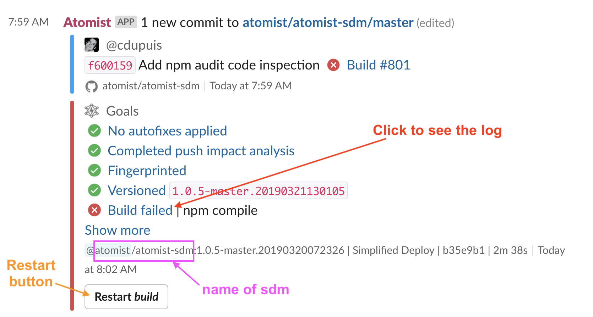

This page contains a collection of troubleshooting techniques.

## A goal failed

When a goal fails, click on its link to see the log.

Some goal failures result in a Restart button. Look for one below the goal set. (If you want
your custom goal to have a Restart button, pass the `retry` property in the [GoalDetails](goaldetails.md).)

If you want to start the goals over, try `@atomist reset goals \<name of SDM>`. (Hint: The name of the SDM that set the goals is also indicated in small print below the goal set.)
By default this will start a new goal set on the last commit to the default branch; you can pass [parameters](repo-targeting-params.md) to target a different push.

If the "reset goals" command does not exist for your SDM, install the [goal state pack](../pack/goalstate.md).

## SDM registration

To answer questions like:

* Where is my SDM running?
* What version of my SDM is running?

You can gather information in multiple ways:

* Check the [web interface](team.md#see-your-sdm-registration)
* run the command: "describe sdm your-sdms-name" (If you aren't sure of the name, try "describe sdm" and check the help message.)
* run the command: "show skills"

## Running SDM locally in team mode

When you run an SDM locally with `atomist start`, you get to test your local version on real events.

### providing token

If you see this error during goal or command execution:

`Error: Neither 'orgToken' nor 'clientToken' has been injected. Please add a repo-scoped GitHub token to your configuration.`

then add a `token` property at the top level in `$HOME/.atomist/client.config.json` containing your
GitHub token. For example, mine is in an environment variable called GITHUB_TOKEN, so I added this:

`"token": "${GITHUB_TOKEN}",`

You need this because goal execution (for autofixes, for instance, which push commits) require GitHub
authorization, and while in production your SDM gets the token from Atomist, by default Atomist does not send secrets like that to your locally-running SDM. Instead, provide your own GitHub token in configuration.

### Required configuration values

When you see something like:

`Failed to load /path/to/your/sdm/lib/atomist.config.js.configuration: Required @Value 'sdm.some.config.value' not available`

then your SDM is looking for a configuration value. You can the requested one to the `config` in your `$HOME/.atomist/client.config.json` file.
It's OK to put an empty string in it, if you aren't going to use the particular automation that needs it.

I've also seen this error when I used `configurationValue`[apidoc-configurationvalue] in the initialization of a top-level constant. Calling that function before the SDM
has started up creates a required value before the configuration has been loaded, which prevents the SDM from starting at all. I moved the call
to `configurationValue` in to my goal executor function, and then it had access to what it needed.

[apidoc-configurationvalue]: https://atomist.github.io/automation-client/modules/_lib_configuration_.html#configurationvalue (API Doc for configurationValue)

## Running SDM in local mode

Basic diagnostics:

When you run the SDM with `atomist start --local`, it will print that it has
"started in local mode".

If you have `atomist feed` running in another terminal, then you'll see a message there when
a local-mode SDM starts or stops. It looks something like: `# general 2019-01-17 12:55:39 My Software Delivery Machine java-refactor-demo-sdm:0.1.0 is now connected`.

To see which SDMs are available to the command line, run `atomist show sdms`. To see the
commands they supply, run `atomist show skills`.

### the CLI does not see my local SDM

If your SDM does not show in `atomist show sdms`, perhaps it chose the wrong port. The command line looks for SDMs at ports 2866-2876.

See the [section on SDM logging](logging.md#configuring-sdm-logs) for how to set log level to "debug". Then restart your SDM, and search its output for the log statement revealing the port where it listens: `running at 'http://127.0.0.1:2866'` (or similar).

If yours is running on a port not in 2866-2876, you might have a PORT environment
variable set. Try removing that or setting it to something in that range.

The hostname defaults to 127.0.0.1, and can be overridden by a config value
`"local": { "hostname": "your-local-hostname-goes-here" }` in either the `configuration` object in the SDM's `index.ts` or in your `$HOME/atomist/client.config.json`.

### I turned up the log level but it still isn't logging enough

The full list of where SDM configuration, and therefore logging, can be set is [here](https://atomist.github.io/automation-client/modules/_lib_configuration_.html?_ga=2.189235115.1635154328.1550526486-1203552146.1527824248#loadconfiguration).
If you set `configuration.logging.level` in `index.ts` but you're still seeing the default (info):

* check your `$HOME/.atomist/client.config.json` to see if it is defined there.
This has higher preference.

## atomist feed

### Lifecycle listener is already running

If you type `atomist feed` and is says you have one already running, then something is listening on port 6660.
When I get this, I go look in my other terminal windows for a running feed, and use that one or Ctrl-C out of it.

If that doesn't work, I find out what process is on port 6660 and kill it. On Mac: `lsof -i :6660` to find the process, then
see its PID and pass that to `kill`.