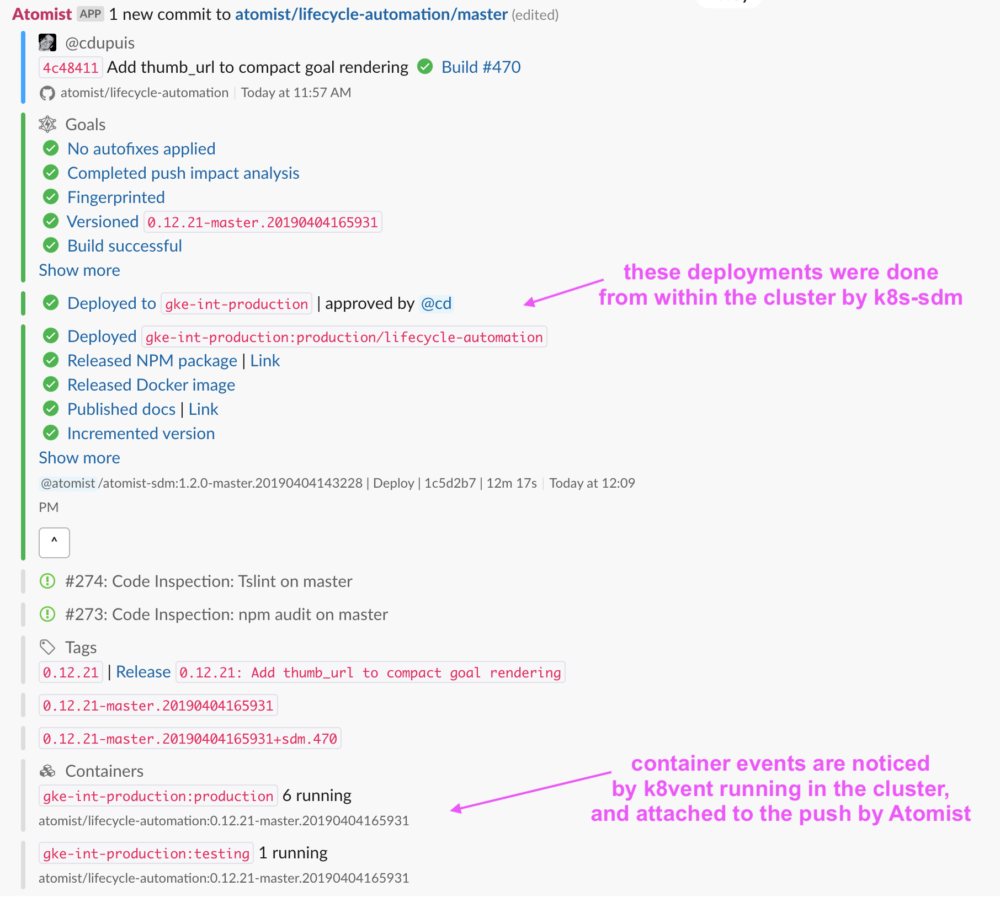

The Uhura SDM performs delivery automatically on enabled projects. It looks at the content
of the project and decides what to do.

Currently the Uhura SDM knows how to build Node projects with `build`, `test`, or `lint` scripts
defined in `package.json`. This SDM is designed to add more capabilities to deliver different stacks.

Atomist operates a version of the Uhura SDM that is available to all Atomist workspaces. It can deploy
applications on Kubernetes: our Kubernetes for demo purposes, and then your Kubernetes cluster when you configure it.

Uhura can:

* Demonstrate Atomist delivery, by creating a Node repository and then deploying it to our Kubernetes so that you can see what that looks like.
* Deliver your Node projects to your Kubernetes cluster, once you [configure it][configure-k8s]. These can be based on our sample starting points, or your existing projects that follow certain conventions.
* Be a starting point for your own SDM: [create and run an Uhura SDM of your own](../quick-start.md), and it will replace the globally available instance. Customize with the full power of TypeScript, and complete control over your SDM's environment.

For more information, check the Uhura project on [GitHub][].

[github]: https://github.com/atomist/uhura

## Create a new repository

Uhura defines a [project generator](../developer/create.md) for Node projects. This takes an existing repository as a starting point
for a new one, modifies the code, and creates a new repository for you to build on.

To try this out, go to the [web app](https://app.atomist.com) and click the "New Project" plus icon on the left.

The globally available Uhura instance offers three starting points, each in the [atomist-seeds] organization, each forked from a handy
public Node project.

## Configure Uhura to deploy to your Kubernetes cluster
[configure-k8s]: #configure-uhura-to-deploy-to-your-kubernetes-cluster

If you can deploy to Kubernetes from your computer, then you can configure the Uhura SDM to deploy your
applications there.

### Set up connections

* Install the latest version of the [Atomist CLI](../developer/cli.md) with `npm install -g @atomist/cli`.
* Run `atomist config` to connect to your Atomist workspace with an API Key
* Set up your own environment to deploy to kubernetes: `minikube start` if you're running Kubernetes locally, or set your context with `kubectl config`. You will need admin access to the cluster for the next step - if you don't have it, you'll find out in a minute.

### Install Atomist deployment into your cluster

Atomist needs two utilities to run inside your cluster:

[`k8s-sdm`](https://github.com/atomist/k8s-sdm) is a software delivery machine that only does deployment
of your projects. It connects to Atomist for triggering, then performs the deployments into the cluster it runs in.

[`k8vent`](https://github.com/atomist/k8vent) listens to Kubernetes events and sends them to Atomist, which connects them to other events. With these, [push notifications](lifecycle.md) display services and containers running, relating commits to the environments where they are deployed.



#### How does this work inside Kubernetes?

Picture your kubernetes cluster with at least four namespaces inside. One of these holds your production deployments. We usually call this one 
`production`, but any namespace will do. It doesn't have to exist yet. A second namespace holds testing deployments; we usually call this one `testing`. A third namespace is created for you to hold the `k8s-sdm` utility. This is the `sdm` namespace, and you can deploy your custom SDMs here too. Finally, there is the `k8vent` namespace, created to hold the `k8vent` utility, which sends Kubernetes events to Atomist.

Both `k8s-sdm` and `k8vent` make calls the Kubernetes API within the cluster. 
To give them permissions to do this, we create 
[service accounts](https://kubernetes.io/docs/reference/access-authn-authz/rbac/#service-account-permissions)
for them, along with 
[cluster roles](https://kubernetes.io/docs/reference/access-authn-authz/rbac/#kubectl-create-clusterrolebinding) 
and [cluster role binding](https://kubernetes.io/docs/reference/access-authn-authz/rbac/#kubectl-create-clusterrolebinding).
 This gives `k8vent` permission to watch pod events, and it gives `k8s-sdm` permission to manipulate pods, namespaces, and more. For full details, see our [Kubernetes Extension documentation](../pack/kubernetes.md).

The Atomist command line can install these to your cluster for you:

* First make up a name for the environment you are deploying to, e.g. "testing" or "production" or "my-kube-env". Let's say you pick "my-kube-env".
* Run `atomist kube --environment=my-kube-env`.

!!! Troubleshooting
    You may run into an error message saying something like `forbidden: attempt to grant extra privilege`. If you do, it means your Kubernetes user doesn't have admin privileges.

    If your user doesn't have admin privileges (and if you're using Google Cloud, by default it doesn't) then try to grant yourself permissions with the following command:

    1. Figure out your Kubernetes username. Good luck on this one! But if you're using Google Cloud, you can try `gcloud config get-value account`. Let's say your username is `KIM@example.com`.

    2. Execute the following:

    ```
    kubectl create clusterrolebinding "cluster-admin-binding-KIM" --clusterrole cluster-admin --user KIM@example.com
    ```

    If that doesn't work, find someone who does have admin privileges and get them to install these Atomist deployment utilities into the cluster.

### Tell Uhura to deploy here

Your next objective is to run a command to configure Uhura to deploy to the environment you just defined:

`configure deployment atomist uhura cluster=my-kube-env goal=testing`
`configure deployment atomist uhura cluster=my-kube-env goal=production`

where `my-kube-env` is the string you used above. You can use different clusters as testing and production targets, as long as you set them both up using the steps above.

How do you run a command? If you have integrated Atomist with [chat], you can send Atomist a direct message. Otherwise:

* log in to the [Atomist web app](https://app.atomist.com)
* go to the SDM page
* click on `Command Shell`
* in the little prompt that pops up, enter the command.
* see a response in the notification bar on the right.

### Try it

The next time you push code to a project that is enabled for Uhura, you'll see deploy goals for testing and production.
When these execute, they will deploy your project into your own cluster.

[github]: https://github.com/atomist/uhura